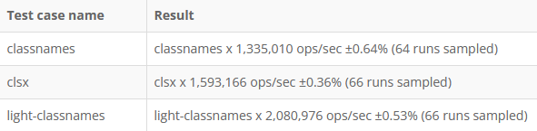

# Benchmarking

In order to show and prove the performance of this package in contrast to the other packages, [measurethat.net](https://www.measurethat.net/) is used. This site allows every person running this benchmark on his own browser and seeing the results. Of course the test case being is used is a common one combining elements of every possible usage of the package. The link for the [benchmark](https://www.measurethat.net/Benchmarks/Show/17041/classnames-vs-clsx-vs-light-classnames). An example of the results of running this benchmark: (FireFox 96):

